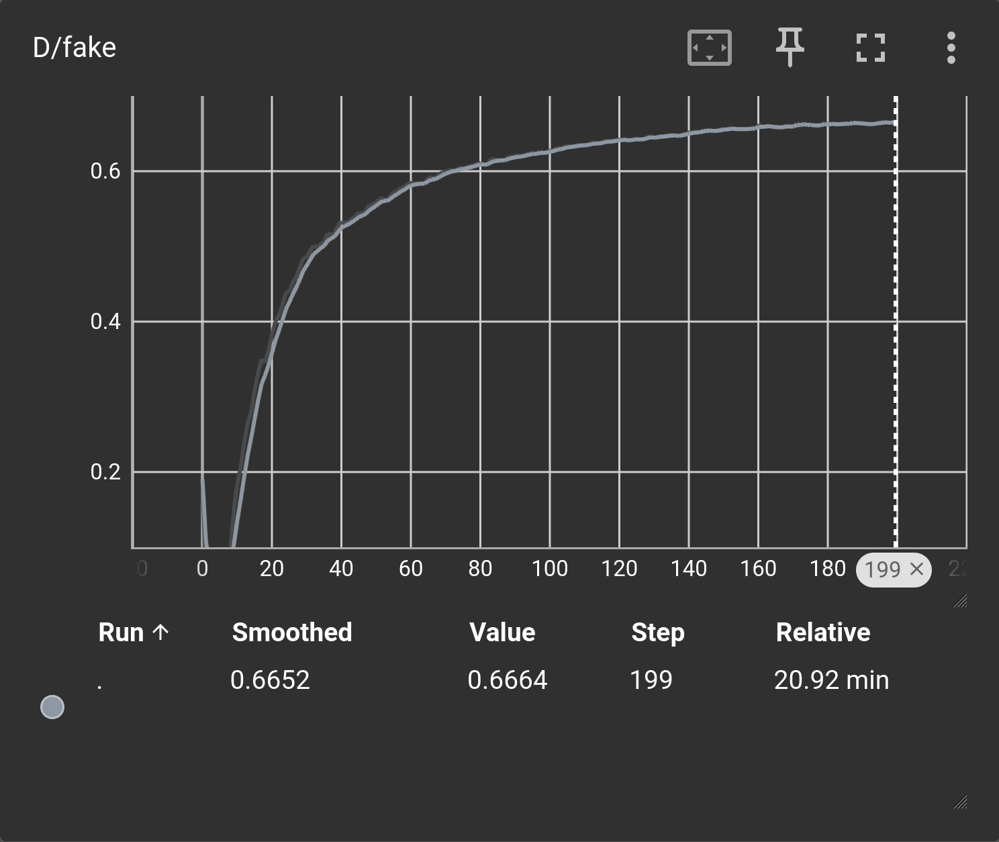
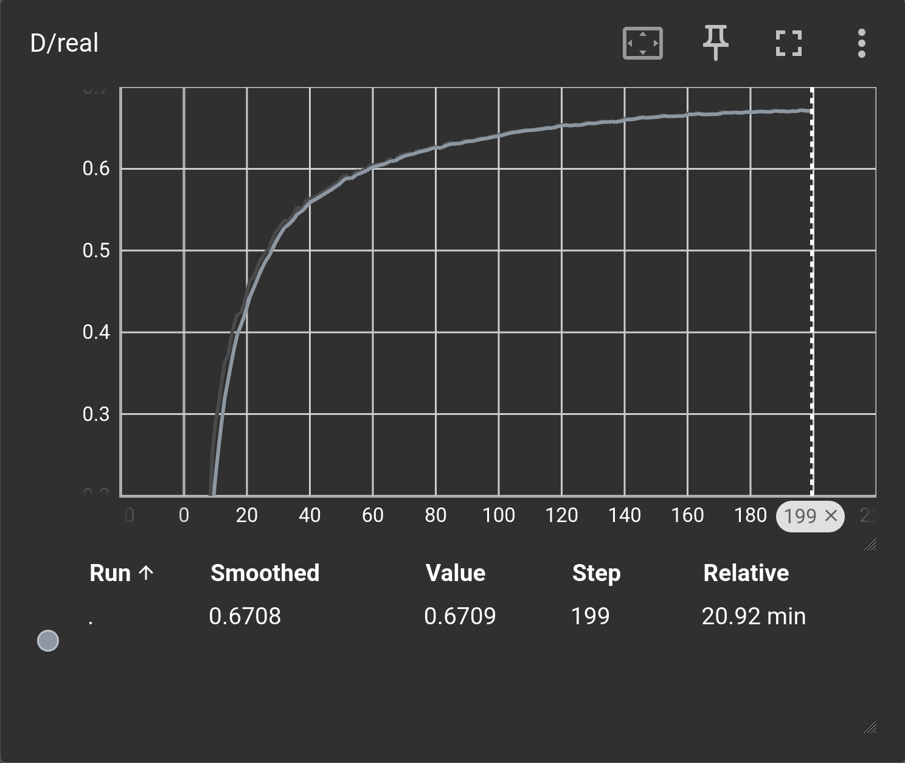
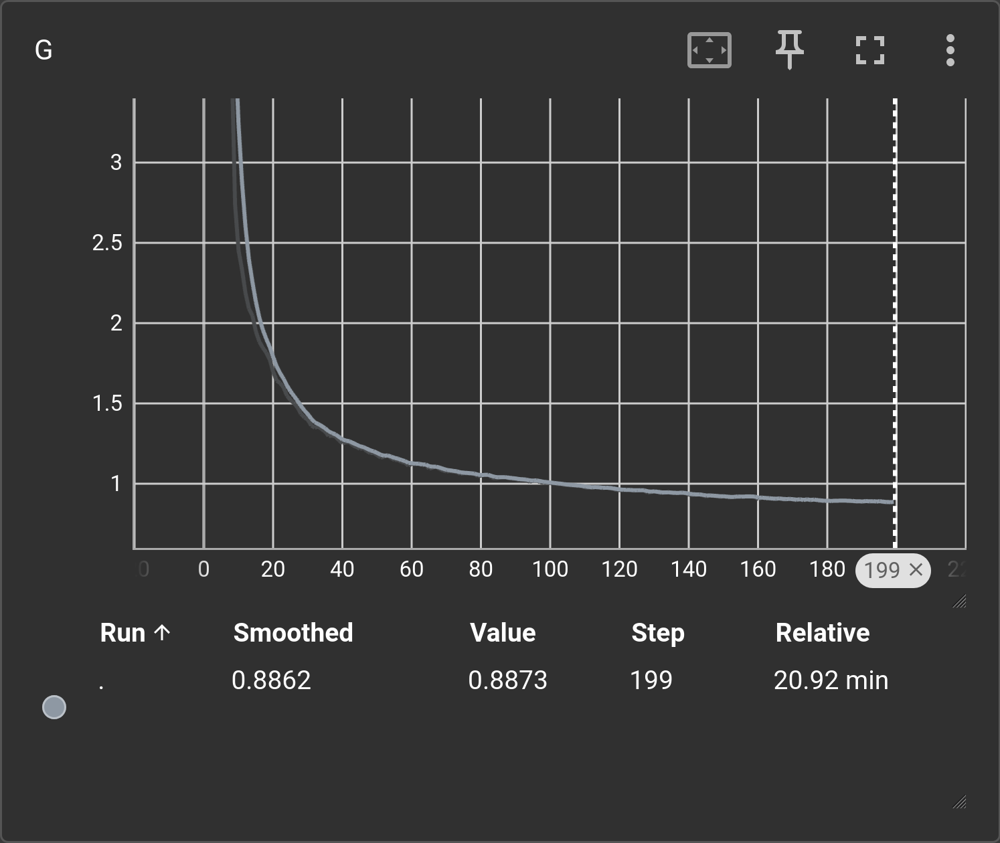
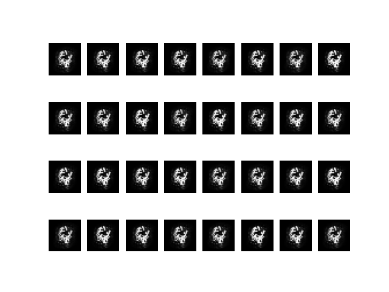
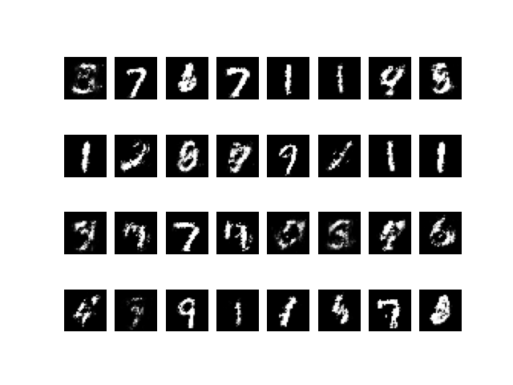
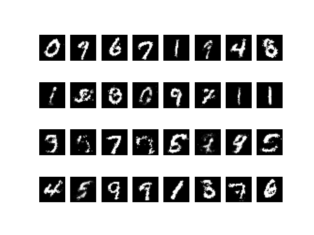
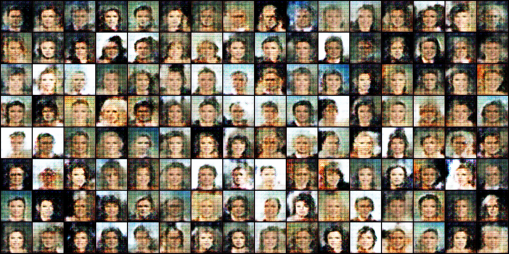
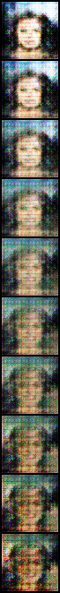

# mnist-gan
Training: 
- *Vanilla dense GAN on MNIST* Minimal GAN example before introducing modern techniques.
- *DCGAN on CelebA*

## Running
Build docker image
```docker
docker build -t mnist-gan .
```
Run docker container
```docker
docker run --privileged --gpus all --ipc=host --ulimit memlock=-1 --ulimit stack=67108864 -it --rm -v $PWD:/source -v <path_to_data_folder>:/data mnist-gan
```
Run training
```python
python run_train.py vanilla_mnist
```

## Vanilla GAN - MNIST

### Model
**Generator**
* 3-layer MLP
* ReLU
* sigmoid

**Discriminator**
* 2-layer Maxout
* Dropout
* Final linear projection
* Binary classification

### Data and hyperparameters
* MNIST train
* SGD (momentum=0.5)
* lr d = 1e-1
* lr g = 1e-1
* latent dim = 100
* batch size = 100

### Losses
BCE. 
*  
*  
*  

### Generations
Samples generated from a fixed latent vector.
* Initial 
* 10 epochs 
* 20 epochs 
* 30 epochs 
* 40 epochs 
* 50 epochs 

### Interpolations


## DCGAN - CelebA

### Model
**Generator**
* Blocks: 4 * ConvTrasnpose/BatchNorm/ReLU
* ConvTrasnpose
* tanh

**Discriminator**
* Blocks: Conv / BatchNorm/ LeakyReLU

### Data and hyperparameters
* CelebA 
* Adam (betas=(0.5, 0.999))
* lr d = 1e-4
* lr g = 3e-4
* latent dim = 100
* batch size = 128

### Generations
* 

### Interpolations
* 
