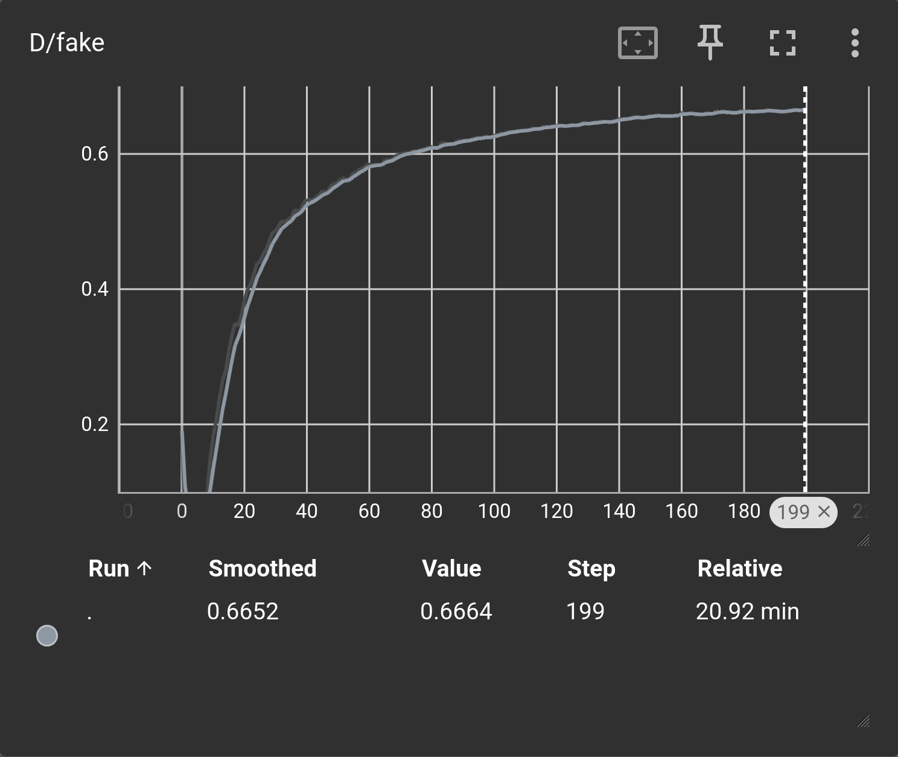
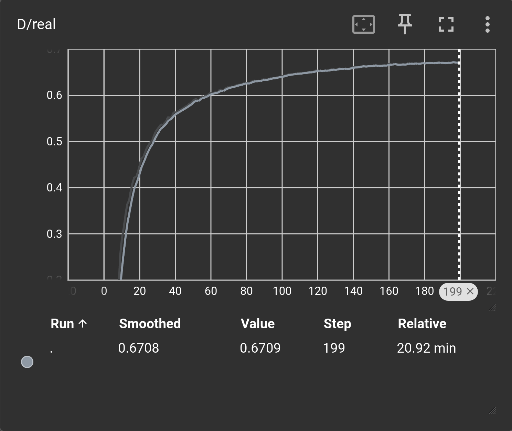
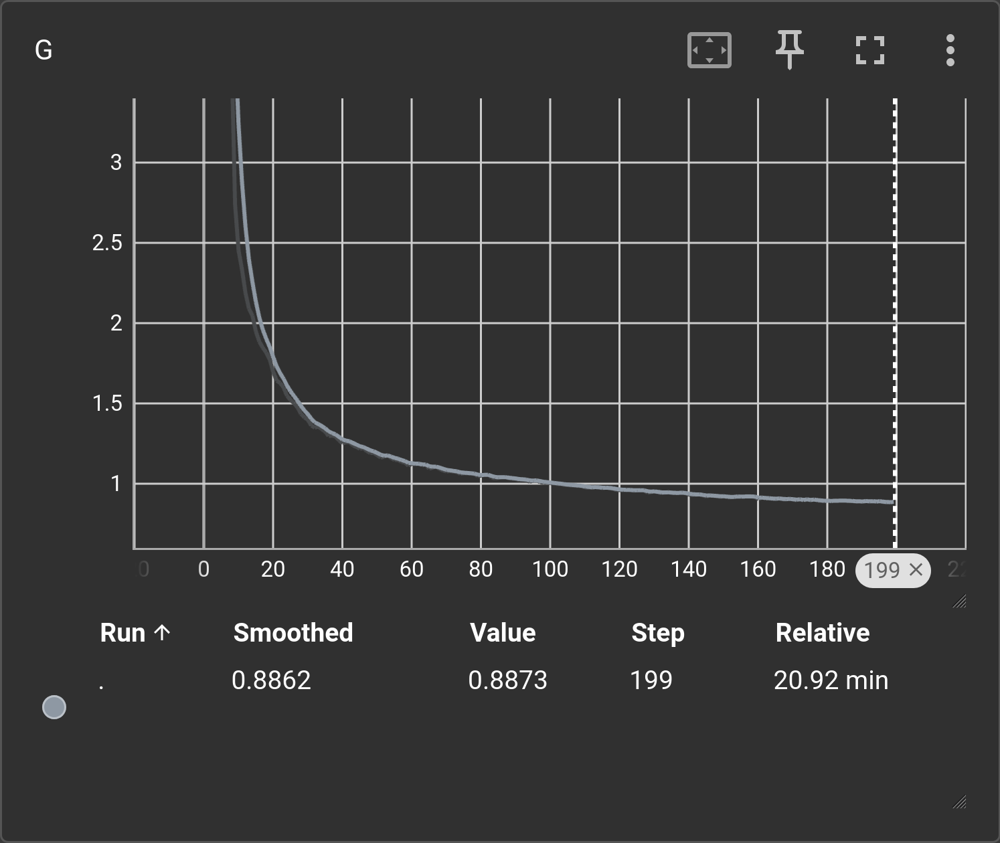
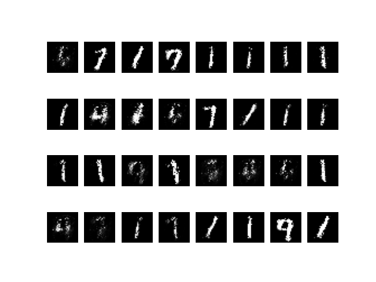
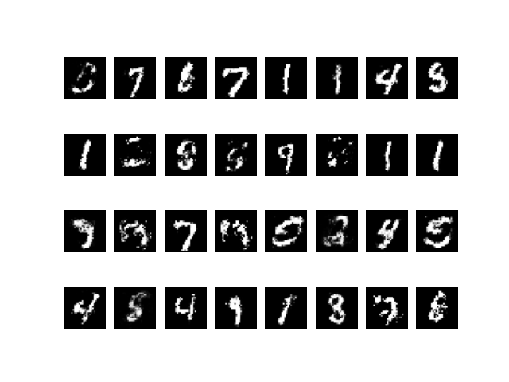
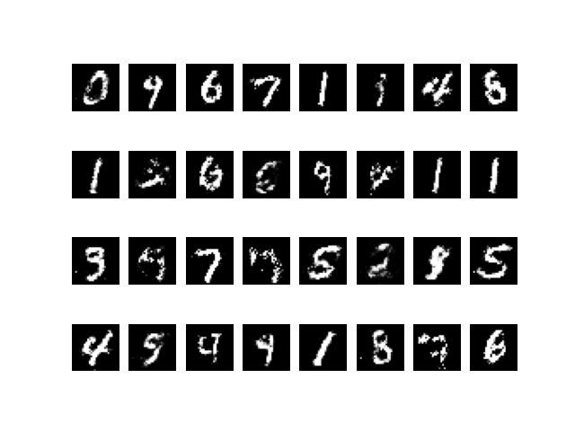
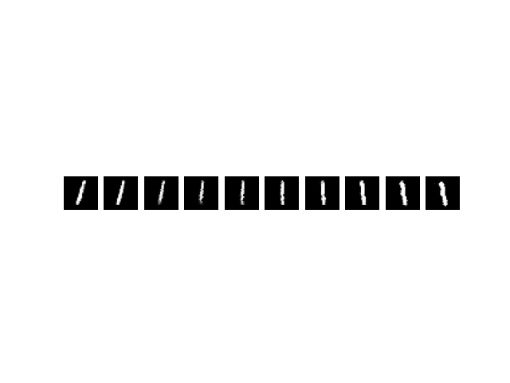

# mnist-gan
Training a vanilla dense GAN on MNIST. 

Minimal GAN example before introducing modern techniques.

## Model
**Generator**
* 3-layer MLP
* ReLU
* BatchNorm
* sigmoid

**Discriminator**
* 2-layer Maxout
* Dropout
* Final linear projection
* Binary classification

## Data and hyperparameters
* MNIST train
* SGD (momentum=0.5)
* lr d = 1e-1
* lr g = 1e-1
* latent dim = 100
* batch size = 100

## Losses
BCE. GAN losses are not expected to decrease monotonically.
*  
*  
*  

## Generations
Samples generated from a fixed latent vector.
* Initial 
* 10 epochs 
* 20 epochs 
* 30 epochs 
* 40 epochs 
* 50 epochs 

## Interpolations


## Running
Build docker image
```docker
docker build -t mnist-gan .
```
Run docker container
```docker
docker run --privileged --gpus all --ipc=host --ulimit memlock=-1 --ulimit stack=67108864 -it --rm -v $PWD:/source -v <path_to_data_folder>:/data mnist-gan
```
Run training
```python
python run_train.py
```
