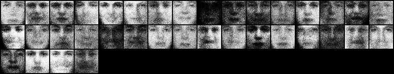
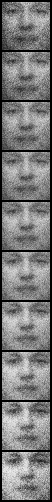
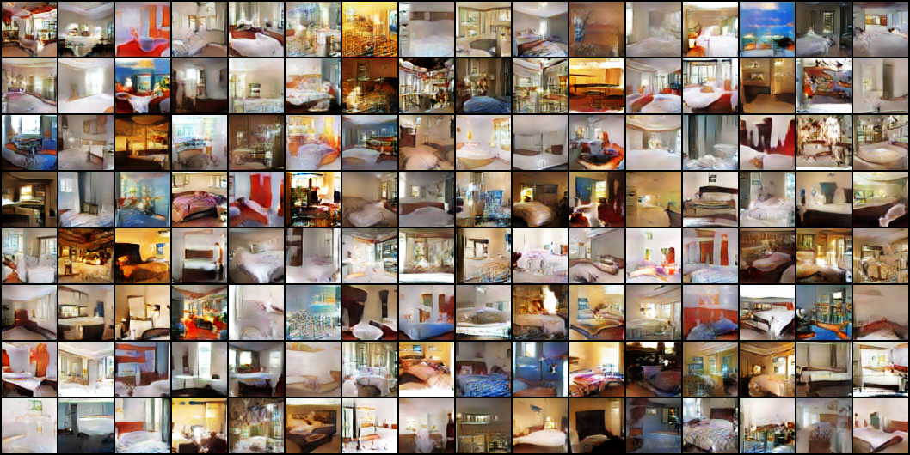
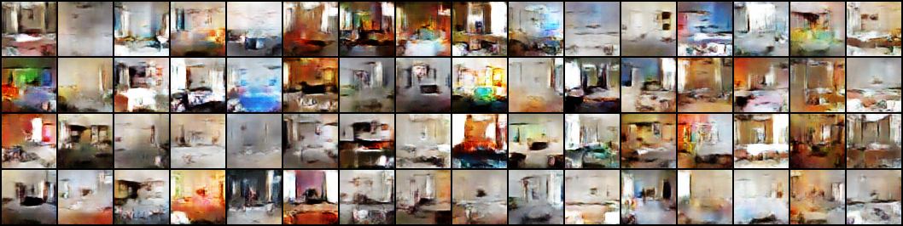
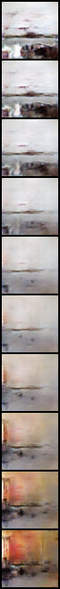
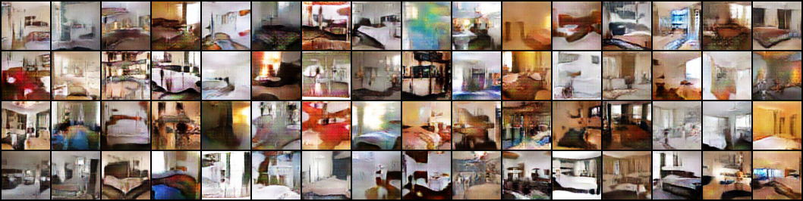
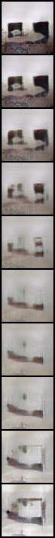
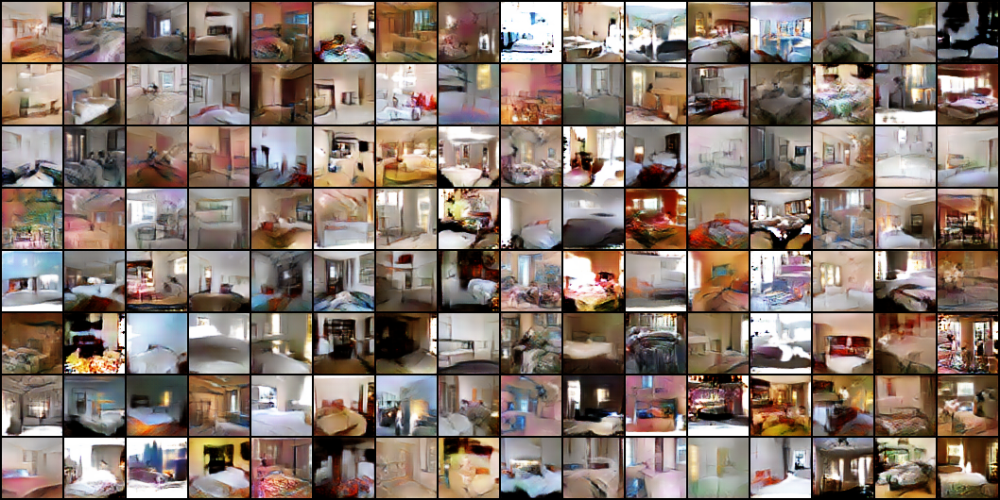
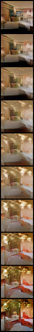

# mnist-gan
A PyTorch implementation of timeline of GAN models from vanilla to WGAN-GP. The goal of this repository is to understand why architectural changes were introduced, how training stability has improved and how losses behave in practice.

| Model       | Dataset      | Architecture         | Loss             | Optimizer |
| ----------- | ------------ | -------------------- | ---------------- | --------- |
| Vanilla GAN | MNIST, TFD   | MLP + Maxout         | BCE              | SGD       |
| DCGAN       | CelebA, LSUN | Conv / ConvTranspose | BCE              | Adam      |
| WGAN        | LSUN         | DCGAN architecture   | Wasserstein      | RMSprop   |
| WGAN-GP     | LSUN         | DCGAN + InstanceNorm | Wasserstein + GP | Adam      |


## Running
Build docker image
```docker
docker build -t mnist-gan .
```
Run docker container
```docker
docker run --privileged --gpus all --ipc=host --ulimit memlock=-1 --ulimit stack=67108864 -it --rm -v $PWD:/source -v <path_to_data_folder>:/data mnist-gan
```
Run training
```python
python run_train.py configs/vanilla_mnist.yaml
```

## Vanilla GAN - MNIST
Minimal GAN example before introducing modern techniques. Uses Maxout and linear layers. 

### Model
**Generator**
* 3-layer MLP
* ReLU
* sigmoid

**Discriminator**
* 2-layer Maxout
* Dropout
* Final linear projection
* Binary classification

### Data and hyperparameters
* MNIST train
* SGD (momentum=0.5)
* lr d = 1e-1
* lr g = 1e-1
* latent dim = 100
* batch size = 100

### Losses
BCE. 
*  
*  
*  

### Generations
Samples generated from a fixed latent vector.
* Initial 
* 10 epochs 
* 20 epochs 
* 30 epochs 
* 40 epochs 
* 50 epochs 

### Interpolations


## Vanilla GAN - TFD
### Generations


### Interpolations


## DCGAN - CelebA

### Model
Adds Conv and ConvTranspose, BatchNorm instead of Maxout, LeakyReLU instead of ReLU, Adam optimizer. 
**Generator**
* Blocks: 4 * ConvTrasnpose/BatchNorm/ReLU
* ConvTranspose
* tanh

**Discriminator**
* Blocks: Conv / BatchNorm/ LeakyReLU

### Data and hyperparameters
* CelebA 
* Adam (betas=(0.5, 0.999))
* lr d = 1e-4
* lr g = 3e-4
* latent dim = 100
* batch size = 128

### Generations


### Interpolations


## DCGAN - LSUN bedrooms

### Generations


### Interpolations


## WGAN - LSUN bedrooms
Uses same architecture as DCGAN, critic instead of dicriminator. Changed loss to Wasserstein distance, which maximizes the gap between the average score of real images and the average score of fake images. WGAN trains critic more often than generator. Optimizer changed to RMSprop to work with non-stationary optimization landscape due to rapidly changing critic. Clips critic weights to maintain Lipschitz continuity.
### Generations


### Interpolations


## WGAN-GP - LSUN bedrooms
Uses same architecture as DCGAN, but with BatchNorm2d replaced by InstanceNorm2d in critic. Instead of weight clipping uses gradient penalty for critic loss to maintain Lipschitz continuity. Uses Adam.

### Generations


### Interpolations



## SNGAN - LSUN bedrooms
Adds spectral normalization and hinge loss for critic.
### Generations


### Interpolations
